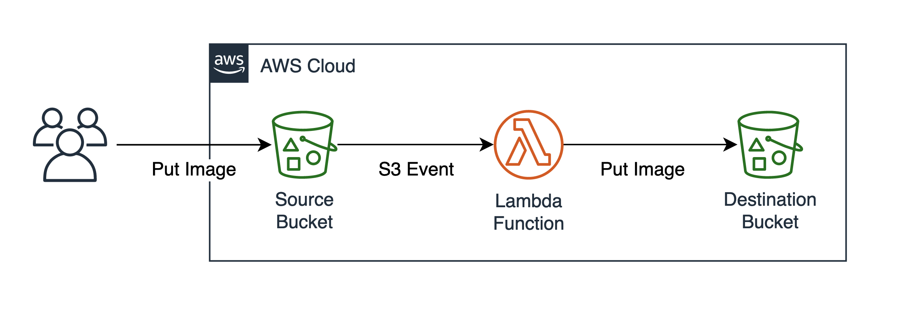

# I Want To Be A Unicorn Demo App


This solution demonstrates the use of AWS S3 events and AWS Lambda to provide a serverless image processor. Users upload images to a source S3 bucket, an event will trigger a Lambda function that uses the OpenCV2 library to detect human faces in the image and overlay a unicorn horn to the faces. The created image is saved to a destination S3 bucket.
<br><br>

# Architecture

<br><br>

# Implementation Steps

## Set Operating Region
1. From the AWS console, set the region to Longon (eu-west-2)


<br><br>
## Create Destination Bucket
<br>
1. Use the search bar to find and load 'S3'


<br>
2. Click 'Create bucket' button

<br>
3. Enter bucket name as 'i-want-to-be-a-unicorn-output-' suffix with your Account ID (no spaces or hypens)
<br>   Your Account ID can be found by clicking your authenticated role in the top left of the console window


<br>
4. Select EU (London) eu-west-2 in the AWS Region


<br>
5. Scroll to the bottom and click 'Create bucket'

<br><br>
## Deploy Serverless Function

Using a prepared AWS Serverless Application Model (SAM) template we will automate the provisioning of the source bucket and Lambda function

<br>
1. Use the search bar to find and load 'CloudShell'


<br>
2. If prompted select a supported region e.g. Europe (Ireland)

<br>
3. Pull the application code from GitHub. Copy and paste the commands into CloudShell

```Shell
git clone https://github.com/smfaro/i-want-to-be-a-unicorn.git
cd i-want-to-be-a-unicorn
```

<br>
4. Build and Deploy the application using AWS Serverless Application Model (SAM). Copy and paste the command into CloudShell

```Shell
sam build && sam deploy --guided
```

<br>
5. You will be guided through the configuration, select the default options by pressing the Enter key for each question


<br>
6. A CloudFormation changeset will be generated to deploy the application, when prompted answer with 'y' and press the Enter key to begin deployment to youe AWS account


<br>
7. On completion you should see a success message.

<br><br>
## Validate Deployment
TODO

<br><br>
## Test Application

1. Use the search bar to find and load 'S3'


<br>
2. Select the source bucket 'i-want-to-be-a-unicorn-source-********"


<br>
3. Click Upload and Add files or drag images into the dotted section. The picture must be clear, containing human faces.


<br>
4. Return the the S3 bucket list, click the 'Buckets' in left menu (use hamburger icon to expand menu)

<br>
5. Select the destination bucket 'i-want-to-be-a-unicorn-output-********". A modified image should exist (if not, wait and refresh).

<br>
6. Open the modified image


---


# Under the hood

This app used the OpenCV2 library. This is obtained from https://github.com/awslabs/lambda-opencv

Build OpenCV library using Docker

AWS Lambda functions run in an Amazon Linux environment, so libraries should be built for Amazon Linux. You can build Python-OpenCV libraries for Amazon Linux using the provided Dockerfile, like this:

```
git clone https://github.com/iandow/opencv_aws_lambda
cd opencv_aws_lambda
docker build --tag=lambda-layer-factory:latest .
docker run --rm -it -v $(pwd):/data lambda-layer-factory cp /packages/cv2-python37.zip /data
```